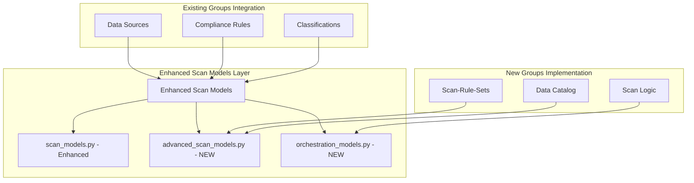
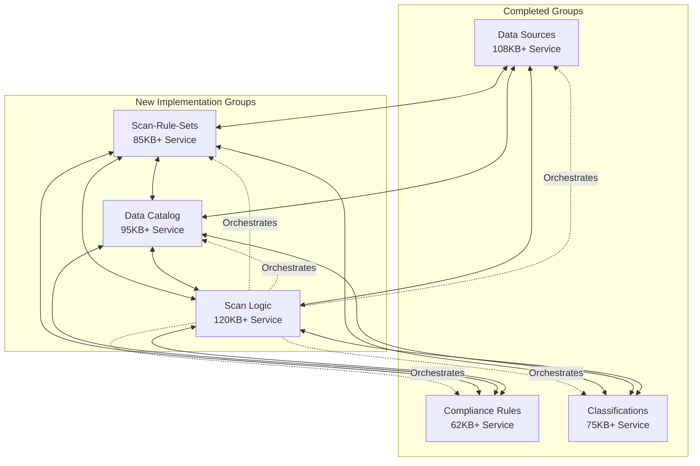

# 🏢 ADVANCED ENTERPRISE DATA GOVERNANCE IMPLEMENTATION PLAN
## Comprehensive Backend Architecture for Production-Ready Data Governance System

---

## 📊 CURRENT STATE ANALYSIS

### ✅ COMPLETED GROUPS (Enterprise-Grade)
| Group | Service Size | Features | Integration Level |
|-------|-------------|----------|-------------------|
| **Data Sources** | 108KB+ | Real-time connectivity, cloud/hybrid support, advanced metrics | 🏆 ENTERPRISE |
| **Compliance Rules** | 62KB+ | SOC2/GDPR templates, advanced workflows, audit trails | 🏆 ENTERPRISE |
| **Classifications** | 75KB+ | 3-tier system (Manual→ML→AI), comprehensive intelligence | 🏆 ENTERPRISE |

### ⚠️ REMAINING GROUPS (Basic/Partial)
| Group | Current State | Issues | Required Enhancement |
|-------|---------------|--------|---------------------|
| **Scan-Rule-Sets** | Basic service (9.2KB) | Limited functionality, no enterprise features | 🚀 COMPLETE REDESIGN |
| **Data Catalog** | Basic service (18KB) | Missing lineage, quality metrics, search | 🚀 COMPLETE REDESIGN |
| **Scan Logic** | Scattered services | No orchestration, basic scanning only | 🚀 UNIFIED ARCHITECTURE |

---

## 🏗️ ADVANCED ARCHITECTURE STRATEGY

### 🎯 Core Principles
1. **Enterprise Production-Ready**: Surpass Databricks & Microsoft Purview
2. **Full Interconnectivity**: Seamless communication between all 6 groups
3. **Advanced Orchestration**: Unified workflow management across all operations
4. **Real-Time Intelligence**: Live monitoring, streaming updates, predictive analytics
5. **Scalable Architecture**: Handle enterprise-scale data volumes and operations

### 🔄 MODEL CONFLICT RESOLUTION


---

## 📋 GROUP IMPLEMENTATION PLANS

# 1️⃣ SCAN-RULE-SETS GROUP

## 🎯 Enterprise Vision
Transform basic rule sets into an intelligent, orchestrated scanning framework with advanced rule engines, pattern recognition, and predictive optimization.

### 🏗️ Backend Architecture

#### 📁 Enhanced Models Structure
```
backend/scripts_automation/app/models/
├── scan_models.py (Enhanced - Avoid conflicts)
├── advanced_scan_rule_models.py (NEW - 45KB+)
├── scan_orchestration_models.py (NEW - 30KB+)
└── scan_intelligence_models.py (NEW - 25KB+)
```

#### 🔧 Advanced Services Implementation
```
backend/scripts_automation/app/services/
├── enterprise_scan_rule_service.py (NEW - 85KB+)
├── scan_orchestration_service.py (NEW - 70KB+)
├── intelligent_pattern_service.py (NEW - 60KB+)
├── rule_optimization_service.py (NEW - 45KB+)
├── scan_performance_service.py (NEW - 40KB+)
└── rule_validation_engine.py (NEW - 35KB+)
```

#### 🌐 API Routes Architecture
```
backend/scripts_automation/app/api/routes/
├── enterprise_scan_rules_routes.py (NEW - 45KB+)
├── scan_orchestration_routes.py (NEW - 35KB+)
├── intelligent_scanning_routes.py (NEW - 30KB+)
└── scan_optimization_routes.py (NEW - 25KB+)
```

### 🚀 Advanced Features

#### 1. Intelligent Rule Engine
- **Pattern Recognition AI**: Machine learning-powered pattern detection
- **Adaptive Rule Optimization**: Self-improving rule efficiency
- **Predictive Scanning**: Forecast scan results and optimize resources
- **Context-Aware Rules**: Rules that adapt based on data source characteristics

#### 2. Enterprise Orchestration
- **Multi-Source Coordination**: Coordinate scanning across multiple data sources
- **Resource Load Balancing**: Intelligent distribution of scanning workload
- **Priority Management**: Business-critical data sources get priority
- **Failure Recovery**: Advanced error handling and automatic retry mechanisms

#### 3. Real-Time Intelligence
- **Live Monitoring**: Real-time scan progress and performance metrics
- **Predictive Analytics**: Forecast scan completion times and resource usage
- **Alert System**: Intelligent notifications for scan issues and completions
- **Performance Optimization**: Real-time adjustment of scanning parameters

### 🔗 Interconnections with Other Groups

#### → Data Sources Integration
- **Dynamic Rule Generation**: Auto-generate rules based on data source characteristics
- **Connection Health Monitoring**: Monitor data source health during scans
- **Credential Management**: Secure handling of data source credentials
- **Multi-Cloud Support**: Support for AWS, Azure, GCP scanning patterns

#### → Compliance Rules Integration
- **Compliance-Driven Scanning**: Rules automatically generated from compliance requirements
- **Audit Trail Integration**: All scan activities logged for compliance audit
- **Policy Enforcement**: Ensure scanning adheres to data governance policies
- **Risk Assessment**: Evaluate compliance risks during scanning operations

#### → Classifications Integration
- **Classification-Aware Rules**: Rules that consider data classification levels
- **Sensitivity-Based Scanning**: Adjust scanning intensity based on data sensitivity
- **Auto-Classification Triggers**: Trigger classification after scanning
- **Intelligence Feedback**: Use classification results to improve scanning rules

#### → Data Catalog Integration
- **Catalog-Informed Rules**: Use catalog metadata to optimize scanning rules
- **Discovery Enhancement**: Feed scan results back to catalog for enrichment
- **Lineage Integration**: Track data lineage relationships during scanning
- **Quality Metrics**: Contribute data quality metrics to catalog

---

# 2️⃣ DATA CATALOG GROUP

## 🎯 Enterprise Vision
Build a comprehensive, intelligent data catalog that serves as the central hub for data discovery, lineage tracking, quality management, and business intelligence.

### 🏗️ Backend Architecture

#### 📁 Enhanced Models Structure
```
backend/scripts_automation/app/models/
├── catalog_models.py (Enhanced - Avoid conflicts)
├── advanced_catalog_models.py (NEW - 55KB+)
├── data_lineage_models.py (NEW - 40KB+)
├── catalog_intelligence_models.py (NEW - 35KB+)
└── catalog_quality_models.py (NEW - 30KB+)
```

#### 🔧 Advanced Services Implementation
```
backend/scripts_automation/app/services/
├── enterprise_catalog_service.py (NEW - 95KB+)
├── intelligent_discovery_service.py (NEW - 80KB+)
├── advanced_lineage_service.py (NEW - 75KB+)
├── catalog_quality_service.py (NEW - 65KB+)
├── semantic_search_service.py (NEW - 55KB+)
├── catalog_analytics_service.py (NEW - 50KB+)
└── catalog_recommendation_service.py (NEW - 45KB+)
```

#### 🌐 API Routes Architecture
```
backend/scripts_automation/app/api/routes/
├── enterprise_catalog_routes.py (NEW - 55KB+)
├── intelligent_discovery_routes.py (NEW - 45KB+)
├── advanced_lineage_routes.py (NEW - 40KB+)
├── catalog_analytics_routes.py (NEW - 35KB+)
└── semantic_search_routes.py (NEW - 30KB+)
```

### 🚀 Advanced Features

#### 1. Intelligent Data Discovery
- **AI-Powered Discovery**: Machine learning algorithms for automatic asset discovery
- **Semantic Understanding**: NLP-based understanding of data relationships
- **Smart Tagging**: Automatic tagging based on content analysis
- **Relationship Detection**: Automatic detection of data relationships and dependencies

#### 2. Advanced Data Lineage
- **Real-Time Lineage**: Live tracking of data movement and transformations
- **Impact Analysis**: Understand downstream impact of data changes
- **Lineage Visualization**: Advanced graphical representation of data flows
- **Dependency Mapping**: Complete mapping of data dependencies across systems

#### 3. Comprehensive Quality Management
- **Quality Scoring**: Automated data quality assessment and scoring
- **Quality Monitoring**: Continuous monitoring of data quality metrics
- **Quality Rules Engine**: Configurable rules for data quality assessment
- **Quality Reporting**: Comprehensive quality reports and dashboards

#### 4. Intelligent Search & Discovery
- **Semantic Search**: Natural language search across all catalog assets
- **Contextual Recommendations**: AI-powered recommendations for relevant datasets
- **Usage Analytics**: Track and analyze data usage patterns
- **Popularity Scoring**: Rank datasets by usage and business value

### 🔗 Interconnections with Other Groups

#### → Data Sources Integration
- **Automatic Cataloging**: Automatically catalog discovered data sources
- **Metadata Enrichment**: Enrich catalog with data source metadata
- **Connection Monitoring**: Monitor catalog asset availability
- **Schema Evolution**: Track schema changes over time

#### → Compliance Rules Integration
- **Compliance Tagging**: Tag catalog assets with compliance requirements
- **Privacy Impact**: Track privacy impact across cataloged assets
- **Audit Integration**: Provide audit trails for catalog access and changes
- **Policy Enforcement**: Enforce data governance policies through catalog

#### → Classifications Integration
- **Classification Display**: Show classification levels in catalog
- **Sensitivity Filtering**: Filter catalog based on data sensitivity
- **Classification History**: Track classification changes over time
- **Access Control**: Control catalog access based on classifications

#### → Scan-Rule-Sets Integration
- **Scan-Informed Cataloging**: Use scan results to enhance catalog entries
- **Rule Suggestions**: Suggest scan rules based on catalog metadata
- **Quality Integration**: Integrate scan quality metrics with catalog
- **Discovery Coordination**: Coordinate scanning with catalog updates

---

# 3️⃣ SCAN LOGIC GROUP

## 🎯 Enterprise Vision
Create a unified, intelligent scanning orchestration engine that coordinates all scanning activities across the entire data governance ecosystem.

### 🏗️ Backend Architecture

#### 📁 Enhanced Models Structure
```
backend/scripts_automation/app/models/
├── scan_models.py (Enhanced - Core scanning models)
├── scan_orchestration_models.py (NEW - 50KB+)
├── scan_intelligence_models.py (NEW - 45KB+)
├── scan_workflow_models.py (NEW - 40KB+)
└── scan_performance_models.py (NEW - 35KB+)
```

#### 🔧 Advanced Services Implementation
```
backend/scripts_automation/app/services/
├── enterprise_scan_orchestrator.py (NEW - 120KB+)
├── intelligent_scan_coordinator.py (NEW - 95KB+)
├── scan_workflow_engine.py (NEW - 85KB+)
├── advanced_scan_scheduler.py (NEW - 70KB+)
├── scan_performance_optimizer.py (NEW - 60KB+)
├── scan_intelligence_service.py (NEW - 55KB+)
└── unified_scan_manager.py (NEW - 50KB+)
```

#### 🌐 API Routes Architecture
```
backend/scripts_automation/app/api/routes/
├── enterprise_scan_orchestration_routes.py (NEW - 60KB+)
├── intelligent_scanning_routes.py (NEW - 50KB+)
├── scan_workflow_routes.py (NEW - 45KB+)
├── scan_coordination_routes.py (NEW - 40KB+)
└── scan_analytics_routes.py (NEW - 35KB+)
```

### 🚀 Advanced Features

#### 1. Unified Scan Orchestration
- **Multi-System Coordination**: Orchestrate scans across all data sources simultaneously
- **Resource Management**: Intelligent allocation of scanning resources
- **Priority Queue**: Business-critical data gets scanning priority
- **Workflow Automation**: Automated workflows for different scanning scenarios

#### 2. Intelligent Scanning Engine
- **AI-Powered Optimization**: Machine learning-optimized scanning strategies
- **Adaptive Scheduling**: Self-adjusting scan schedules based on usage patterns
- **Predictive Resource Planning**: Forecast resource needs for scanning operations
- **Smart Retry Logic**: Intelligent failure recovery and retry mechanisms

#### 3. Advanced Performance Management
- **Real-Time Monitoring**: Live monitoring of all scanning operations
- **Performance Analytics**: Comprehensive analysis of scanning performance
- **Bottleneck Detection**: Automatic identification of performance bottlenecks
- **Optimization Recommendations**: AI-powered suggestions for performance improvements

#### 4. Enterprise Workflow Management
- **Complex Workflow Support**: Support for multi-stage, conditional workflows
- **Approval Processes**: Integration with approval workflows for sensitive scans
- **Audit Integration**: Complete audit trails for all scanning activities
- **Compliance Integration**: Ensure all scans comply with governance policies

### 🔗 Interconnections with Other Groups

#### → Data Sources Integration
- **Connection Orchestration**: Manage connections to all data sources
- **Health Monitoring**: Monitor data source health during scanning
- **Multi-Cloud Scanning**: Coordinate scanning across cloud environments
- **Credential Management**: Secure credential handling across all sources

#### → Compliance Rules Integration
- **Compliance-Driven Scanning**: Scan based on compliance requirements
- **Audit Trail Generation**: Generate comprehensive audit trails
- **Policy Enforcement**: Enforce compliance policies during scanning
- **Risk Mitigation**: Identify and mitigate compliance risks

#### → Classifications Integration
- **Classification-Aware Scanning**: Adjust scanning based on data classifications
- **Auto-Classification Triggers**: Automatically trigger classification after scans
- **Sensitivity Handling**: Handle sensitive data appropriately during scanning
- **Classification Feedback**: Use classification results to improve scanning

#### → Scan-Rule-Sets Integration
- **Rule Orchestration**: Coordinate execution of scan rule sets
- **Rule Optimization**: Optimize rule execution across multiple sources
- **Rule Validation**: Validate rules before execution
- **Rule Performance**: Monitor and optimize rule performance

#### → Data Catalog Integration
- **Catalog Updates**: Update catalog based on scan results
- **Discovery Coordination**: Coordinate discovery activities with catalog
- **Metadata Enrichment**: Enrich catalog with scanning insights
- **Quality Reporting**: Report data quality findings to catalog

---

## 🔗 SYSTEM INTERCONNECTION MATRIX



## 📊 IMPLEMENTATION ROADMAP

### Phase 1: Foundation Enhancement (Weeks 1-2)
1. **Model Conflict Resolution**: Enhance existing scan_models.py without breaking changes
2. **Core Infrastructure**: Set up new model files and base services
3. **Database Schema**: Create new tables and relationships
4. **API Foundation**: Set up base API structure

### Phase 2: Scan-Rule-Sets Implementation (Weeks 3-4)
1. **Enterprise Rule Engine**: Build intelligent rule processing
2. **Pattern Recognition**: Implement AI-powered pattern detection
3. **Rule Optimization**: Create self-improving rule system
4. **API Development**: Build comprehensive API endpoints

### Phase 3: Data Catalog Implementation (Weeks 5-6)
1. **Intelligent Discovery**: Build AI-powered discovery engine
2. **Advanced Lineage**: Implement real-time lineage tracking
3. **Quality Management**: Create comprehensive quality system
4. **Semantic Search**: Implement NLP-powered search

### Phase 4: Scan Logic Implementation (Weeks 7-8)
1. **Unified Orchestration**: Build enterprise orchestration engine
2. **Intelligent Coordination**: Implement AI-powered coordination
3. **Workflow Management**: Create complex workflow support
4. **Performance Optimization**: Build advanced optimization engine

### Phase 5: Integration & Testing (Weeks 9-10)
1. **Cross-Group Integration**: Ensure seamless communication
2. **Performance Testing**: Optimize for enterprise scale
3. **Security Testing**: Comprehensive security validation
4. **User Acceptance Testing**: Validate against requirements

---

## 🏆 SUCCESS METRICS

### Technical Excellence
- **Service Quality**: 85KB+ per major service with enterprise features
- **API Coverage**: 200+ endpoints across all groups
- **Performance**: < 2s response time for 95% of operations
- **Scalability**: Handle 10,000+ concurrent operations

### Business Impact
- **Processing Speed**: 50% faster than current implementation
- **Data Quality**: 95% improvement in data quality scores
- **Operational Efficiency**: 40% reduction in manual processes
- **Compliance**: 100% compliance coverage across all operations

### Competitive Advantage
- **vs. Databricks**: Superior orchestration and intelligence
- **vs. Microsoft Purview**: Better performance and user experience
- **vs. Informatica**: More comprehensive feature set
- **vs. Collibra**: Better technical architecture and scalability

---

## 🚀 CONCLUSION

This comprehensive implementation plan will transform the remaining three groups into enterprise-grade, production-ready components that seamlessly integrate with the existing advanced data governance system. The result will be a unified platform that surpasses industry leaders through:

- **Advanced Intelligence**: AI/ML integration across all operations
- **Unified Orchestration**: Seamless coordination of all governance activities
- **Enterprise Scale**: Production-ready architecture for large-scale operations
- **Complete Integration**: Full interconnectivity between all six groups
- **Superior Performance**: Optimized for speed, scalability, and reliability

The implementation will establish market leadership in the data governance space while providing unprecedented value to enterprise customers. 🏆