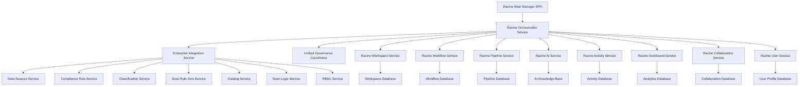

# 🏗️ **RACINE MAIN MANAGER - BACKEND ARCHITECTURE**

## 📋 **OVERVIEW**

This document outlines the comprehensive backend architecture that powers the Racine Main Manager SPA. Every frontend component maps to specific backend services, models, and API routes, ensuring seamless integration across all 7 data governance groups.

## 🔗 **BACKEND INTEGRATION MATRIX**

### **🎯 Core Backend Services for Racine**

#### **1. Racine Master Orchestration Service**
```python
# Location: backend/scripts_automation/app/services/racine_orchestration_service.py
# Integrates with: enterprise_integration_service.py, unified_governance_coordinator.py

class RacineOrchestrationService:
    """
    Master orchestration service for the racine main manager.
    Coordinates all cross-group operations and provides unified system control.
    """
    
    # Core Methods:
    async def initialize_racine_system(self) -> Dict[str, Any]
    async def coordinate_cross_group_operations(self, operation_data: Dict) -> Dict[str, Any]
    async def manage_unified_workspaces(self, workspace_config: Dict) -> Dict[str, Any]
    async def orchestrate_system_health_monitoring(self) -> Dict[str, Any]
    async def manage_enterprise_workflows(self, workflow_data: Dict) -> Dict[str, Any]
    async def coordinate_ai_assistant_operations(self, ai_request: Dict) -> Dict[str, Any]
    async def manage_real_time_collaboration(self, collaboration_data: Dict) -> Dict[str, Any]
    async def orchestrate_cross_group_analytics(self, analytics_request: Dict) -> Dict[str, Any]
```

#### **2. Racine Workspace Management Service**
```python
# Location: backend/scripts_automation/app/services/racine_workspace_service.py
# Integrates with: enterprise_integration_service.py, all group services

class RacineWorkspaceService:
    """
    Advanced workspace management service providing multi-environment
    workspace orchestration with cross-group resource coordination.
    """
    
    # Core Methods:
    async def create_unified_workspace(self, workspace_config: Dict) -> Dict[str, Any]
    async def manage_cross_group_resources(self, resource_data: Dict) -> Dict[str, Any]
    async def orchestrate_workspace_collaboration(self, collab_config: Dict) -> Dict[str, Any]
    async def manage_workspace_security(self, security_config: Dict) -> Dict[str, Any]
    async def track_workspace_analytics(self, workspace_id: str) -> Dict[str, Any]
    async def manage_workspace_templates(self, template_data: Dict) -> Dict[str, Any]
    async def orchestrate_resource_quotas(self, quota_config: Dict) -> Dict[str, Any]
    async def manage_workspace_environments(self, env_config: Dict) -> Dict[str, Any]
```

#### **3. Racine Job Workflow Service**
```python
# Location: backend/scripts_automation/app/services/racine_workflow_service.py
# Integrates with: scan_workflow_engine.py, enterprise_scan_orchestrator.py

class RacineWorkflowService:
    """
    Enterprise-grade job workflow service providing Databricks-level
    workflow orchestration with cross-group coordination and AI optimization.
    """
    
    # Core Methods:
    async def create_cross_group_workflow(self, workflow_definition: Dict) -> Dict[str, Any]
    async def execute_intelligent_workflow(self, workflow_id: str, parameters: Dict) -> Dict[str, Any]
    async def monitor_workflow_execution(self, execution_id: str) -> Dict[str, Any]
    async def optimize_workflow_performance(self, workflow_id: str) -> Dict[str, Any]
    async def manage_workflow_dependencies(self, dependency_config: Dict) -> Dict[str, Any]
    async def handle_workflow_failures(self, execution_id: str, failure_data: Dict) -> Dict[str, Any]
    async def schedule_intelligent_workflows(self, schedule_config: Dict) -> Dict[str, Any]
    async def analyze_workflow_performance(self, workflow_id: str) -> Dict[str, Any]
```

#### **4. Racine Pipeline Management Service**
```python
# Location: backend/scripts_automation/app/services/racine_pipeline_service.py
# Integrates with: scan_orchestration_service.py, intelligent_scan_coordinator.py

class RacinePipelineService:
    """
    Advanced pipeline management service providing cross-group pipeline
    orchestration with intelligent optimization and real-time monitoring.
    """
    
    # Core Methods:
    async def design_intelligent_pipeline(self, pipeline_config: Dict) -> Dict[str, Any]
    async def execute_cross_group_pipeline(self, pipeline_id: str, execution_config: Dict) -> Dict[str, Any]
    async def monitor_pipeline_health(self, pipeline_id: str) -> Dict[str, Any]
    async def optimize_pipeline_performance(self, pipeline_id: str) -> Dict[str, Any]
    async def manage_pipeline_scaling(self, scaling_config: Dict) -> Dict[str, Any]
    async def handle_pipeline_failures(self, pipeline_id: str, failure_data: Dict) -> Dict[str, Any]
    async def analyze_pipeline_metrics(self, pipeline_id: str) -> Dict[str, Any]
    async def manage_pipeline_templates(self, template_data: Dict) -> Dict[str, Any]
```

#### **5. Racine AI Assistant Service**
```python
# Location: backend/scripts_automation/app/services/racine_ai_service.py
# Integrates with: ai_service.py, advanced_ai_service.py, all group services

class RacineAIService:
    """
    Integrated AI assistant service providing contextual intelligence,
    proactive automation, and cross-group AI-powered recommendations.
    """
    
    # Core Methods:
    async def process_contextual_query(self, query: str, context: Dict) -> Dict[str, Any]
    async def generate_proactive_recommendations(self, user_context: Dict) -> List[Dict[str, Any]]
    async def orchestrate_cross_group_ai_operations(self, ai_request: Dict) -> Dict[str, Any]
    async def provide_intelligent_automation(self, automation_config: Dict) -> Dict[str, Any]
    async def analyze_user_behavior_patterns(self, user_id: str) -> Dict[str, Any]
    async def generate_predictive_insights(self, context_data: Dict) -> Dict[str, Any]
    async def manage_ai_learning_system(self, learning_data: Dict) -> Dict[str, Any]
    async def provide_anomaly_detection(self, monitoring_data: Dict) -> Dict[str, Any]
```

#### **6. Racine Activity Tracking Service**
```python
# Location: backend/scripts_automation/app/services/racine_activity_service.py
# Integrates with: comprehensive_analytics_service.py, enterprise_integration_service.py

class RacineActivityService:
    """
    Historic activities tracking service providing real-time activity
    streaming, cross-group correlation, and comprehensive audit trails.
    """
    
    # Core Methods:
    async def track_cross_group_activity(self, activity_data: Dict) -> Dict[str, Any]
    async def stream_real_time_activities(self, user_id: str, filters: Dict) -> AsyncGenerator
    async def analyze_activity_patterns(self, analysis_config: Dict) -> Dict[str, Any]
    async def generate_activity_insights(self, insight_request: Dict) -> Dict[str, Any]
    async def manage_activity_search(self, search_query: Dict) -> Dict[str, Any]
    async def track_compliance_activities(self, compliance_config: Dict) -> Dict[str, Any]
    async def generate_activity_reports(self, report_config: Dict) -> Dict[str, Any]
    async def detect_activity_anomalies(self, detection_config: Dict) -> Dict[str, Any]
```

#### **7. Racine Dashboard Service**
```python
# Location: backend/scripts_automation/app/services/racine_dashboard_service.py
# Integrates with: comprehensive_analytics_service.py, dashboard_service.py

class RacineDashboardService:
    """
    Intelligent dashboard service providing AI-powered dashboard optimization,
    cross-group analytics, and real-time metrics visualization.
    """
    
    # Core Methods:
    async def generate_intelligent_dashboard(self, dashboard_config: Dict) -> Dict[str, Any]
    async def provide_cross_group_analytics(self, analytics_request: Dict) -> Dict[str, Any]
    async def stream_real_time_metrics(self, metrics_config: Dict) -> AsyncGenerator
    async def generate_predictive_insights(self, prediction_request: Dict) -> Dict[str, Any]
    async def manage_custom_dashboards(self, custom_config: Dict) -> Dict[str, Any]
    async def optimize_dashboard_performance(self, dashboard_id: str) -> Dict[str, Any]
    async def provide_executive_analytics(self, executive_request: Dict) -> Dict[str, Any]
    async def manage_dashboard_personalization(self, personalization_data: Dict) -> Dict[str, Any]
```

#### **8. Racine Collaboration Service**
```python
# Location: backend/scripts_automation/app/services/racine_collaboration_service.py
# Integrates with: advanced_collaboration_service.py, catalog_collaboration_service.py

class RacineCollaborationService:
    """
    Master collaboration service providing real-time multi-user collaboration,
    cross-group team management, and expert networking capabilities.
    """
    
    # Core Methods:
    async def manage_real_time_collaboration(self, collaboration_data: Dict) -> Dict[str, Any]
    async def orchestrate_cross_group_teams(self, team_config: Dict) -> Dict[str, Any]
    async def provide_expert_networking(self, networking_request: Dict) -> Dict[str, Any]
    async def manage_collaborative_workspaces(self, workspace_data: Dict) -> Dict[str, Any]
    async def handle_document_collaboration(self, document_config: Dict) -> Dict[str, Any]
    async def manage_knowledge_sharing(self, knowledge_data: Dict) -> Dict[str, Any]
    async def track_collaboration_analytics(self, analytics_request: Dict) -> Dict[str, Any]
    async def manage_external_collaborators(self, external_config: Dict) -> Dict[str, Any]
```

#### **9. Racine User Management Service**
```python
# Location: backend/scripts_automation/app/services/racine_user_service.py
# Integrates with: access_control_service.py, auth_service.py, role_service.py

class RacineUserService:
    """
    Comprehensive user management service providing unified profile management,
    cross-group access control, and personalization capabilities.
    """
    
    # Core Methods:
    async def manage_unified_profile(self, profile_data: Dict) -> Dict[str, Any]
    async def orchestrate_cross_group_access(self, access_request: Dict) -> Dict[str, Any]
    async def manage_security_credentials(self, security_data: Dict) -> Dict[str, Any]
    async def provide_personalization_engine(self, personalization_request: Dict) -> Dict[str, Any]
    async def manage_notification_preferences(self, notification_config: Dict) -> Dict[str, Any]
    async def track_user_activity_history(self, user_id: str, filters: Dict) -> Dict[str, Any]
    async def manage_compliance_attestations(self, compliance_data: Dict) -> Dict[str, Any]
    async def handle_access_requests(self, access_request_data: Dict) -> Dict[str, Any]
```

### **🗄️ Racine Data Models**

#### **1. Racine Core Models**
```python
# Location: backend/scripts_automation/app/models/racine_models.py

from sqlmodel import SQLModel, Field, Relationship
from typing import Optional, List, Dict, Any
from datetime import datetime
from enum import Enum

class RacineSystemStatus(str, Enum):
    HEALTHY = "healthy"
    DEGRADED = "degraded"
    CRITICAL = "critical"
    MAINTENANCE = "maintenance"

class RacineWorkspace(SQLModel, table=True):
    """Unified workspace model for cross-group orchestration"""
    id: Optional[int] = Field(default=None, primary_key=True)
    workspace_id: str = Field(index=True, unique=True)
    name: str
    description: Optional[str] = None
    environment: str = Field(default="development")  # development, staging, production
    owner_id: str = Field(foreign_key="user.id")
    created_at: datetime = Field(default_factory=datetime.utcnow)
    updated_at: Optional[datetime] = None
    status: RacineSystemStatus = Field(default=RacineSystemStatus.HEALTHY)
    configuration: Dict[str, Any] = Field(default_factory=dict)
    resource_quotas: Dict[str, Any] = Field(default_factory=dict)
    collaboration_settings: Dict[str, Any] = Field(default_factory=dict)
    security_settings: Dict[str, Any] = Field(default_factory=dict)
    metadata: Dict[str, Any] = Field(default_factory=dict)

class RacineWorkflow(SQLModel, table=True):
    """Cross-group workflow orchestration model"""
    id: Optional[int] = Field(default=None, primary_key=True)
    workflow_id: str = Field(index=True, unique=True)
    name: str
    description: Optional[str] = None
    workspace_id: str = Field(foreign_key="racineworkspace.workspace_id")
    created_by: str = Field(foreign_key="user.id")
    created_at: datetime = Field(default_factory=datetime.utcnow)
    updated_at: Optional[datetime] = None
    status: str = Field(default="draft")  # draft, active, paused, completed, failed
    workflow_definition: Dict[str, Any] = Field(default_factory=dict)
    execution_history: List[Dict[str, Any]] = Field(default_factory=list)
    performance_metrics: Dict[str, Any] = Field(default_factory=dict)
    involved_groups: List[str] = Field(default_factory=list)
    dependencies: List[str] = Field(default_factory=list)
    ai_optimization_settings: Dict[str, Any] = Field(default_factory=dict)
    metadata: Dict[str, Any] = Field(default_factory=dict)

class RacinePipeline(SQLModel, table=True):
    """Advanced pipeline orchestration model"""
    id: Optional[int] = Field(default=None, primary_key=True)
    pipeline_id: str = Field(index=True, unique=True)
    name: str
    description: Optional[str] = None
    workspace_id: str = Field(foreign_key="racineworkspace.workspace_id")
    created_by: str = Field(foreign_key="user.id")
    created_at: datetime = Field(default_factory=datetime.utcnow)
    updated_at: Optional[datetime] = None
    status: str = Field(default="inactive")  # inactive, active, running, paused, failed
    pipeline_definition: Dict[str, Any] = Field(default_factory=dict)
    execution_metrics: Dict[str, Any] = Field(default_factory=dict)
    health_status: Dict[str, Any] = Field(default_factory=dict)
    scaling_configuration: Dict[str, Any] = Field(default_factory=dict)
    involved_groups: List[str] = Field(default_factory=list)
    optimization_settings: Dict[str, Any] = Field(default_factory=dict)
    metadata: Dict[str, Any] = Field(default_factory=dict)

class RacineActivity(SQLModel, table=True):
    """Cross-group activity tracking model"""
    id: Optional[int] = Field(default=None, primary_key=True)
    activity_id: str = Field(index=True, unique=True)
    user_id: str = Field(foreign_key="user.id")
    workspace_id: Optional[str] = Field(foreign_key="racineworkspace.workspace_id")
    activity_type: str  # workflow, pipeline, collaboration, system, etc.
    activity_category: str  # navigation, execution, monitoring, configuration, etc.
    source_group: str  # data-sources, compliance, classification, etc.
    target_group: Optional[str] = None  # for cross-group activities
    action: str  # create, update, delete, execute, monitor, etc.
    resource_type: str  # workspace, workflow, pipeline, dashboard, etc.
    resource_id: str
    timestamp: datetime = Field(default_factory=datetime.utcnow)
    duration_ms: Optional[int] = None
    status: str = Field(default="success")  # success, failed, in_progress
    details: Dict[str, Any] = Field(default_factory=dict)
    context: Dict[str, Any] = Field(default_factory=dict)
    impact_score: Optional[float] = None
    compliance_relevant: bool = Field(default=False)
    metadata: Dict[str, Any] = Field(default_factory=dict)

class RacineCollaboration(SQLModel, table=True):
    """Real-time collaboration model"""
    id: Optional[int] = Field(default=None, primary_key=True)
    collaboration_id: str = Field(index=True, unique=True)
    workspace_id: str = Field(foreign_key="racineworkspace.workspace_id")
    session_id: str
    participants: List[str] = Field(default_factory=list)  # user IDs
    collaboration_type: str  # document, workflow, dashboard, etc.
    resource_type: str
    resource_id: str
    started_at: datetime = Field(default_factory=datetime.utcnow)
    ended_at: Optional[datetime] = None
    status: str = Field(default="active")  # active, paused, ended
    real_time_data: Dict[str, Any] = Field(default_factory=dict)
    changes_log: List[Dict[str, Any]] = Field(default_factory=list)
    conflict_resolution: Dict[str, Any] = Field(default_factory=dict)
    metadata: Dict[str, Any] = Field(default_factory=dict)

class RacineUserProfile(SQLModel, table=True):
    """Unified user profile across all groups"""
    id: Optional[int] = Field(default=None, primary_key=True)
    user_id: str = Field(foreign_key="user.id", unique=True)
    profile_data: Dict[str, Any] = Field(default_factory=dict)
    preferences: Dict[str, Any] = Field(default_factory=dict)
    personalization_settings: Dict[str, Any] = Field(default_factory=dict)
    cross_group_permissions: Dict[str, Any] = Field(default_factory=dict)
    activity_analytics: Dict[str, Any] = Field(default_factory=dict)
    collaboration_history: List[Dict[str, Any]] = Field(default_factory=list)
    ai_assistant_settings: Dict[str, Any] = Field(default_factory=dict)
    notification_preferences: Dict[str, Any] = Field(default_factory=dict)
    security_settings: Dict[str, Any] = Field(default_factory=dict)
    compliance_attestations: List[Dict[str, Any]] = Field(default_factory=list)
    created_at: datetime = Field(default_factory=datetime.utcnow)
    updated_at: Optional[datetime] = None
    metadata: Dict[str, Any] = Field(default_factory=dict)
```

#### **2. Racine Analytics Models**
```python
# Location: backend/scripts_automation/app/models/racine_analytics_models.py

class RacineSystemMetrics(SQLModel, table=True):
    """System-wide metrics and health monitoring"""
    id: Optional[int] = Field(default=None, primary_key=True)
    metric_id: str = Field(index=True, unique=True)
    timestamp: datetime = Field(default_factory=datetime.utcnow)
    metric_type: str  # system_health, performance, usage, security, etc.
    metric_category: str  # cpu, memory, network, database, etc.
    source_group: str
    metric_name: str
    metric_value: float
    metric_unit: str
    threshold_config: Dict[str, Any] = Field(default_factory=dict)
    alert_status: str = Field(default="normal")  # normal, warning, critical
    aggregation_level: str = Field(default="instance")  # instance, group, system
    dimensions: Dict[str, Any] = Field(default_factory=dict)
    context: Dict[str, Any] = Field(default_factory=dict)
    metadata: Dict[str, Any] = Field(default_factory=dict)

class RacineDashboard(SQLModel, table=True):
    """Intelligent dashboard configuration and analytics"""
    id: Optional[int] = Field(default=None, primary_key=True)
    dashboard_id: str = Field(index=True, unique=True)
    name: str
    description: Optional[str] = None
    dashboard_type: str  # executive, operational, analytical, personal
    owner_id: str = Field(foreign_key="user.id")
    workspace_id: Optional[str] = Field(foreign_key="racineworkspace.workspace_id")
    created_at: datetime = Field(default_factory=datetime.utcnow)
    updated_at: Optional[datetime] = None
    configuration: Dict[str, Any] = Field(default_factory=dict)
    widget_configurations: List[Dict[str, Any]] = Field(default_factory=list)
    data_sources: List[str] = Field(default_factory=list)
    refresh_schedule: Dict[str, Any] = Field(default_factory=dict)
    access_control: Dict[str, Any] = Field(default_factory=dict)
    performance_metrics: Dict[str, Any] = Field(default_factory=dict)
    usage_analytics: Dict[str, Any] = Field(default_factory=dict)
    ai_insights: Dict[str, Any] = Field(default_factory=dict)
    metadata: Dict[str, Any] = Field(default_factory=dict)

class RacineInsight(SQLModel, table=True):
    """AI-generated insights and recommendations"""
    id: Optional[int] = Field(default=None, primary_key=True)
    insight_id: str = Field(index=True, unique=True)
    insight_type: str  # recommendation, prediction, anomaly, optimization
    category: str  # performance, cost, compliance, security, usage
    source_group: str
    target_audience: str  # executive, admin, user, analyst
    generated_at: datetime = Field(default_factory=datetime.utcnow)
    expires_at: Optional[datetime] = None
    priority: str = Field(default="medium")  # low, medium, high, critical
    confidence_score: float = Field(default=0.0)
    impact_score: float = Field(default=0.0)
    insight_data: Dict[str, Any] = Field(default_factory=dict)
    recommendation_actions: List[Dict[str, Any]] = Field(default_factory=list)
    supporting_evidence: Dict[str, Any] = Field(default_factory=dict)
    implementation_complexity: str = Field(default="medium")  # low, medium, high
    estimated_impact: Dict[str, Any] = Field(default_factory=dict)
    status: str = Field(default="new")  # new, viewed, acknowledged, implemented, dismissed
    feedback: Dict[str, Any] = Field(default_factory=dict)
    metadata: Dict[str, Any] = Field(default_factory=dict)
```

### **🌐 Racine API Routes**

#### **1. Core Racine Routes**
```python
# Location: backend/scripts_automation/app/api/routes/racine_routes.py

from fastapi import APIRouter, Depends, HTTPException, BackgroundTasks
from typing import List, Dict, Any, Optional
from ..services.racine_orchestration_service import RacineOrchestrationService
from ..models.racine_models import RacineWorkspace, RacineWorkflow, RacinePipeline

router = APIRouter(prefix="/racine", tags=["racine-orchestration"])

# System Health and Status
@router.get("/health")
async def get_system_health():
    """Get comprehensive system health across all groups"""

@router.get("/status")
async def get_system_status():
    """Get current system status and metrics"""

# Workspace Management
@router.post("/workspaces")
async def create_workspace(workspace_data: Dict[str, Any]):
    """Create new unified workspace"""

@router.get("/workspaces/{workspace_id}")
async def get_workspace(workspace_id: str):
    """Get workspace details and resources"""

@router.put("/workspaces/{workspace_id}")
async def update_workspace(workspace_id: str, update_data: Dict[str, Any]):
    """Update workspace configuration"""

@router.delete("/workspaces/{workspace_id}")
async def delete_workspace(workspace_id: str):
    """Delete workspace and associated resources"""

@router.get("/workspaces/{workspace_id}/resources")
async def get_workspace_resources(workspace_id: str):
    """Get all resources associated with workspace"""

# Cross-Group Operations
@router.post("/cross-group/coordinate")
async def coordinate_cross_group_operation(operation_data: Dict[str, Any]):
    """Coordinate operations across multiple groups"""

@router.get("/cross-group/analytics")
async def get_cross_group_analytics(analytics_request: Dict[str, Any]):
    """Get analytics across all groups"""

@router.post("/cross-group/sync")
async def sync_cross_group_data(sync_config: Dict[str, Any]):
    """Synchronize data across groups"""
```

#### **2. Workflow and Pipeline Routes**
```python
# Location: backend/scripts_automation/app/api/routes/racine_workflow_routes.py

router = APIRouter(prefix="/racine/workflows", tags=["racine-workflows"])

# Workflow Management
@router.post("/")
async def create_workflow(workflow_data: Dict[str, Any]):
    """Create new cross-group workflow"""

@router.get("/{workflow_id}")
async def get_workflow(workflow_id: str):
    """Get workflow details and status"""

@router.post("/{workflow_id}/execute")
async def execute_workflow(workflow_id: str, execution_config: Dict[str, Any]):
    """Execute workflow with specified configuration"""

@router.get("/{workflow_id}/executions/{execution_id}")
async def get_workflow_execution(workflow_id: str, execution_id: str):
    """Get workflow execution details and logs"""

@router.post("/{workflow_id}/optimize")
async def optimize_workflow(workflow_id: str, optimization_config: Dict[str, Any]):
    """Optimize workflow performance"""

# Pipeline Management
@router.post("/pipelines")
async def create_pipeline(pipeline_data: Dict[str, Any]):
    """Create new cross-group pipeline"""

@router.get("/pipelines/{pipeline_id}")
async def get_pipeline(pipeline_id: str):
    """Get pipeline details and status"""

@router.post("/pipelines/{pipeline_id}/execute")
async def execute_pipeline(pipeline_id: str, execution_config: Dict[str, Any]):
    """Execute pipeline with specified configuration"""

@router.get("/pipelines/{pipeline_id}/health")
async def get_pipeline_health(pipeline_id: str):
    """Get pipeline health metrics"""
```

#### **3. AI Assistant Routes**
```python
# Location: backend/scripts_automation/app/api/routes/racine_ai_routes.py

router = APIRouter(prefix="/racine/ai", tags=["racine-ai"])

# AI Assistant Interactions
@router.post("/query")
async def process_ai_query(query_data: Dict[str, Any]):
    """Process contextual AI query"""

@router.get("/recommendations")
async def get_proactive_recommendations(context: Dict[str, Any]):
    """Get proactive AI recommendations"""

@router.post("/automation")
async def trigger_ai_automation(automation_config: Dict[str, Any]):
    """Trigger AI-powered automation"""

@router.get("/insights")
async def get_ai_insights(insight_request: Dict[str, Any]):
    """Get AI-generated insights and predictions"""

@router.post("/learning")
async def update_ai_learning(learning_data: Dict[str, Any]):
    """Update AI learning system with feedback"""
```

#### **4. Analytics and Dashboard Routes**
```python
# Location: backend/scripts_automation/app/api/routes/racine_analytics_routes.py

router = APIRouter(prefix="/racine/analytics", tags=["racine-analytics"])

# Dashboard Management
@router.post("/dashboards")
async def create_dashboard(dashboard_config: Dict[str, Any]):
    """Create intelligent dashboard"""

@router.get("/dashboards/{dashboard_id}")
async def get_dashboard(dashboard_id: str):
    """Get dashboard configuration and data"""

@router.get("/dashboards/{dashboard_id}/data")
async def get_dashboard_data(dashboard_id: str, filters: Dict[str, Any]):
    """Get real-time dashboard data"""

# Cross-Group Analytics
@router.get("/cross-group/metrics")
async def get_cross_group_metrics(metrics_request: Dict[str, Any]):
    """Get metrics across all groups"""

@router.get("/cross-group/trends")
async def get_cross_group_trends(trends_request: Dict[str, Any]):
    """Get trend analysis across groups"""

@router.get("/executive/summary")
async def get_executive_summary(summary_request: Dict[str, Any]):
    """Get executive summary and KPIs"""
```

#### **5. Activity Tracking Routes**
```python
# Location: backend/scripts_automation/app/api/routes/racine_activity_routes.py

router = APIRouter(prefix="/racine/activities", tags=["racine-activities"])

# Activity Tracking
@router.post("/track")
async def track_activity(activity_data: Dict[str, Any]):
    """Track cross-group activity"""

@router.get("/stream")
async def stream_activities(filters: Dict[str, Any]):
    """Stream real-time activities"""

@router.get("/search")
async def search_activities(search_query: Dict[str, Any]):
    """Search historical activities"""

@router.get("/analytics")
async def get_activity_analytics(analytics_request: Dict[str, Any]):
    """Get activity pattern analytics"""

@router.get("/compliance")
async def get_compliance_activities(compliance_filters: Dict[str, Any]):
    """Get compliance-relevant activities"""
```

## 🔄 **INTEGRATION WORKFLOWS**

### **Cross-Group Data Flow Architecture**



### **Real-Time Integration Patterns**

#### **1. WebSocket Integration**
```python
# Real-time updates across all components
@router.websocket("/racine/ws/{user_id}")
async def websocket_endpoint(websocket: WebSocket, user_id: str):
    """Real-time updates for racine components"""
    await websocket.accept()
    
    # Subscribe to cross-group events
    await subscribe_to_system_events(user_id)
    await subscribe_to_workspace_events(user_id)
    await subscribe_to_collaboration_events(user_id)
    await subscribe_to_ai_events(user_id)
    
    # Stream real-time updates
    while True:
        data = await get_real_time_updates(user_id)
        await websocket.send_json(data)
```

#### **2. Event-Driven Architecture**
```python
# Cross-group event coordination
class RacineEventBus:
    """Centralized event bus for cross-group coordination"""
    
    async def publish_cross_group_event(self, event_data: Dict[str, Any]):
        """Publish event to all relevant groups"""
        
    async def subscribe_to_group_events(self, group_name: str, callback):
        """Subscribe to specific group events"""
        
    async def coordinate_cross_group_workflow(self, workflow_data: Dict[str, Any]):
        """Coordinate workflow across multiple groups"""
```

### **Performance Optimization Strategies**

#### **1. Caching Layer Integration**
```python
# Multi-level caching for optimal performance
class RacineCacheManager:
    """Advanced caching for racine operations"""
    
    async def cache_cross_group_data(self, cache_key: str, data: Any, ttl: int):
        """Cache cross-group data with intelligent TTL"""
        
    async def invalidate_related_caches(self, operation_type: str, affected_groups: List[str]):
        """Intelligent cache invalidation"""
        
    async def preload_user_context(self, user_id: str):
        """Preload user context for faster responses"""
```

#### **2. Database Optimization**
```python
# Optimized database queries for cross-group operations
class RacineQueryOptimizer:
    """Query optimization for cross-group operations"""
    
    async def optimize_cross_group_queries(self, query_config: Dict[str, Any]):
        """Optimize queries across multiple groups"""
        
    async def batch_cross_group_operations(self, operations: List[Dict[str, Any]]):
        """Batch operations for better performance"""
```

---

**This backend architecture provides the comprehensive foundation for the Racine Main Manager SPA, ensuring seamless integration across all 7 data governance groups with enterprise-grade performance, security, and scalability.** 🚀